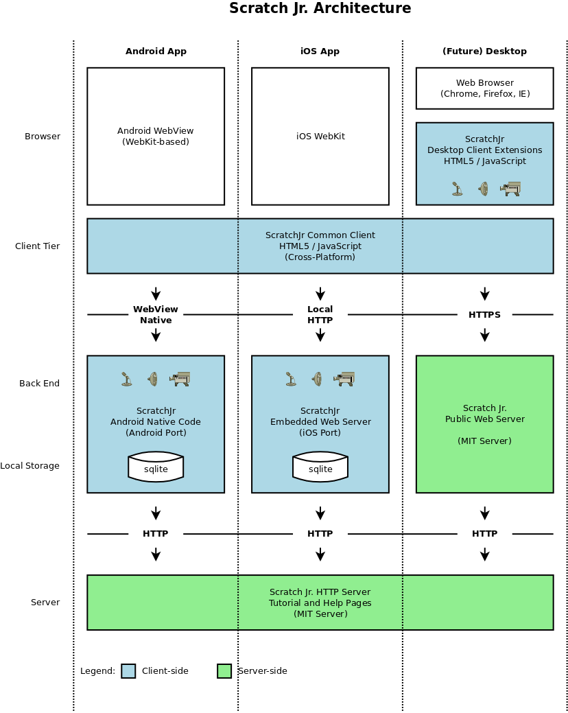

## Overview
This is the official git repository hosting the source code for the
[ScratchJr](http://scratchjr.org/) project.

ScratchJr can be built both for iOS and Android.
A purely web-based version is planned to follow at some point in the future.

Platform | Status
-------- | -------------
iOS      | Released in App Store
Android  | Released in Google Play

## Architecture Overview
The diagram below illustrates the architecture of ScratchJr and
how the iOS (functional), Android (functional) and pure HTML5 (future)
versions share a common client.

## Directory Structure and Projects
This repository has the following directory structure:

* <tt>src/</tt> - Shared JavaScript code for iOS and Android common client. This is where most changes should be made for features, bug fixes, UI, etc.
* <tt>editions/</tt> - Assembly directories for each "flavor" of ScratchJr. These symlink to src for common code, and could diverge in settings and assets.
  * <tt>free/</tt> - Free edition JavaScript, including all shared code for all releases
* <tt>android/</tt> - Android port of Scratch Jr. (Java, Android Studio Projects)
  * <tt>ScratchJr/</tt> - Android Studio Project for ScratchJr Android Application
* <tt>bin/</tt> - Build scripts and other executables
* <tt>doc/</tt> - Developer Documentation
* <tt>ios/</tt> - Xcode project for iOS build. (Make sure to open <tt>ScratchJr.xcworkspace</tt> not <tt>ScratchJr.xcodeproj</tt>)

## Building ScratchJr

### Initial setup

Regardless of whether you are doing iOS development or Android development, you should do these steps.

*These instructions assume you are building both versions on Mac OSX, with [Homebrew](http://brew.sh) installed.*

1. Clone or update the code for this repo
2. Ensure you have node and npm [installed](https://www.npmjs.com/get-npm).
3. Run <tt>sudo easy_install pysvg</tt> to install python svg libraries
4. Run <tt>brew install librsvg</tt> to install commandline `rsvg-convert`
5. Run <tt>brew install imagemagick</tt> to install commandline `magick`
6. In the top level of the scratchjr repo directory, install npm dependencies for bundling the JavaScript: <tt>npm install</tt>

### Analytics
ScratchJr uses the Firebase SDK to record analytics for the app. Scratch Team developers should look for
the configuration files in the Scratch Devs Vault. If you're not on the Scratch Team, then you'll need to
set up your own [app analytics](https://firebase.google.com/products/analytics) with Google Firebase. It's free. Firebase will generate the configuration files for you to download.

1. Place the `google-services.json` file in `editions/free/android-resources`
2. Place the `GoogleService-Info.plist` file in `editions/free/ios-resources`

### iOS

1. To build the iOS version, you need to have a Mac with Xcode
2. Run <tt>brew install cocoapods</tt> to install CocoaPods
3. Run <tt>pod install</tt> to install the Firebase Analytics dependencies
4. Open Xcode
5. In Xcode, open <tt>ios/ScratchJr.xcworkspace</tt>

### Android

1. Install or update Android Studio
2. In Android Studio, open the project <tt>android/ScratchJr</tt>
3. Choose the appropriate flavor/build variant in Android Studio

*Note: you can still do Android development on Ubuntu. Instead of the above install commands, run:*

1. <tt>sudo easy_install pysvg</tt> to install python svg libraries
2. <tt>sudo apt-get install librsvg2-bin</tt> to install rsvg-convert
3. <tt>sudo apt-get install imagemagick</tt> to install ImageMagick

## Where and how to make changes

All changes should be made in a fork. Before making a pull request, ensure all changes pass our linter:
* <tt>npm run lint</tt>

For more information, see [CONTRIBUTING.md](CONTRIBUTING.md).

## Code credits
ScratchJr would not be possible without free and open source libraries, including:
* [Snap.svg](https://github.com/adobe-webplatform/Snap.svg/)
* [JSZip](https://github.com/Stuk/jszip)
* [Intl.js](https://github.com/andyearnshaw/Intl.js)
* [Yahoo intl-messageformat](https://github.com/yahoo/intl-messageformat)

## Acknowledgments
ScratchJr is a collaborative effort between:

* [Tufts DevTech Research Group](http://ase.tufts.edu/devtech/)
* [Lifelong Kindergarten group at MIT Media Lab](http://llk.media.mit.edu/)
* [Playful Invention Company](http://www.playfulinvention.com/)
* [Two Sigma Investments](http://twosigma.com)
